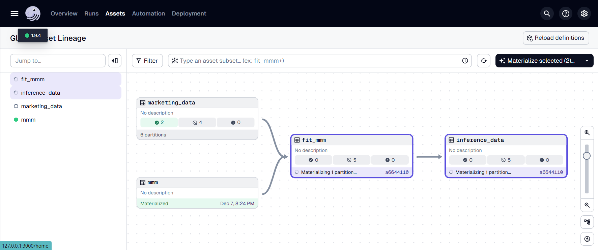
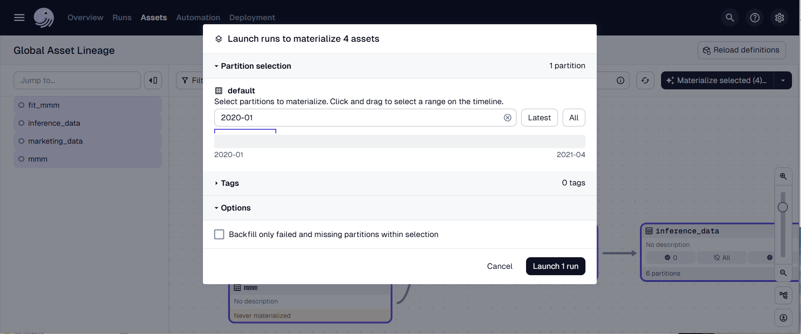

# PyMC-Marketing Dagster Example

> [!WARNING]
>
> This project is still under development. If you would like to contribute,
> please feel free. I have some open issues which may not be complete, but I am
> happy to help you get started.

This repository contains an example of how to use PyMC-Marketing and Dagster to
schedule a Marketing Mix Model.



This allows for easy scheduling and backfilling of the model for given periods
of the data.



Kick off the dagster dev server with the following command:

```bash
export DAGSTER_HOME=$(pwd)/artifacts
mkdir $DAGSTER_HOME
dagster dev -m pymc_marketing_dagster_example.definitions
```

## Local Development

Install the environment with `conda`:

```bash
conda env create -f environment.yml
```

Activate the environment and install the package in editable mode:

```bash
conda activate pymc-marketing-dagster-example
pip install -e .
```
